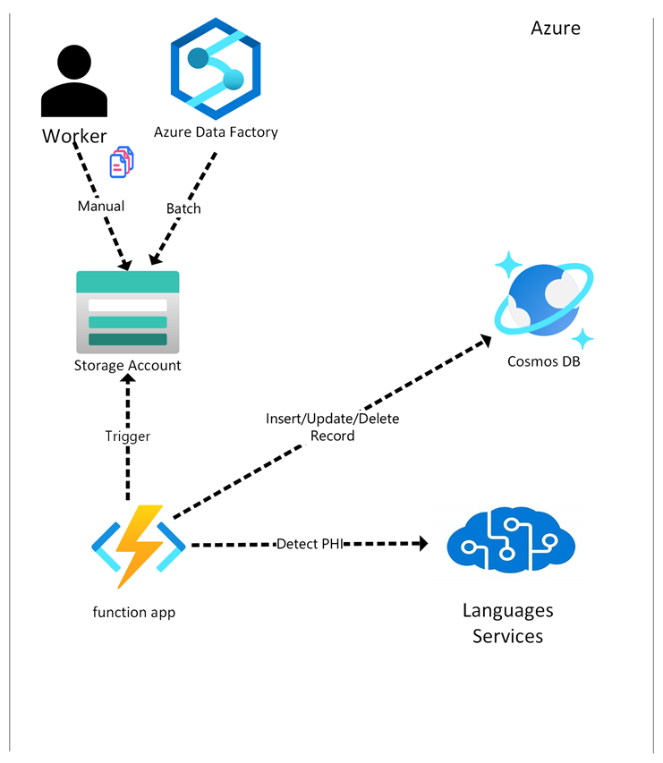

# Overview
This solution uses Cognitive services to detect PHI in blob storage files and
saves records of that "scan" in a CosmosDB table. Refer to the following diagram
to visualize the setup:



# Infra Setup

Deploy infra using the following commands:
```bash
azd auth login
azd up
```

# Local Development

Copy sample.env to .env.
Fill in the following:

- COSMOSDB_ENDPOINT=
- COSMOSDB_DBNAME=
- LANGUAGE_ENDPOINT=

Run the project using the following command(s):

```
dotnet run --project ./Project.csproj
```